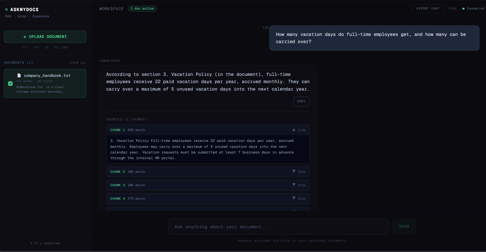

# AskMyDocs — AI Document Q&A Tool

<p align="center">
  <a href="https://intellect-docs-ai.vercel.app"></a>
  
  
</p>

<p align="center">
  
  
  
  
  
  
  
  
</p>

Upload any document and ask questions about it in natural language. The AI answers strictly from your document and shows exactly which part of the document the answer came from — no hallucinations, full transparency.

**🔗 Live Demo:** [intellect-docs-ai.vercel.app](https://intellect-docs-ai.vercel.app)

<p align="center">
  
</p>

### 🎥 Demo Video

https://github.com/user-attachments/assets/8b9ae542-eeef-4067-810f-ab25cf3af470

## What it does

- 📄 Upload any `.txt` or `.pdf` document
- ✅ Select it from the sidebar
- 💬 Ask any question about it in natural language
- 🤖 Get an AI-powered answer based strictly on your document
- 🔍 See exactly which chunks of the document the answer came from, with similarity scores
- 🧪 Built-in eval mode to automatically grade retrieval and answer quality
- 🔐 Anonymous, session-scoped multi-user support — no signup required
- 🛡️ Rate-limited API with automated uptime keepalive
- 🗑️ Delete documents when no longer needed
- ⚡ Real-time streaming responses powered by Groq

## Tech Stack

| Layer | Tech |
|---|---|
| Frontend | Next.js 15, TypeScript, Tailwind CSS |
| AI / LLM | Groq API (LLaMA 3.1 8B Instant) |
| Embeddings | Cohere embed-english-light-v3.0 (384-dim) |
| Database | Supabase (PostgreSQL + pgvector) |
| Retrieval | Supabase pgvector cosine similarity search |
| Rate Limiting | Upstash Redis |
| Deployment | Vercel |

## Architecture

```
Upload                          Query
  │                                │
  ▼                                ▼
chunker.ts              useSessionId.ts (anon session)
(sentence-aware,                  │
 800-char chunks,                 ▼
 150-char overlap)        embedText() — Cohere
  │                                │
  ▼                                ▼
embedBatch() — Cohere      match_chunks() RPC
(384-dim vectors,          (pgvector cosine search,
 batched API calls)         session + doc scoped)
  │                                │
  ▼                                ▼
Supabase: documents +      top-5 matching chunks
chunks (+ embedding_v2)            │
                                    ▼
                            Groq (llama-3.1-8b-instant)
                            streams answer from context
                                    │
                                    ▼
                            UI: answer + source chunks
                            shown with match %
```

The eval pipeline (`/api/eval`) runs this same retrieval → generation path against a fixed question set, then a second Groq call scores each answer — letting retrieval and prompt changes be regression-tested instead of eyeballed.

## How it works

1. User uploads a document
2. `chunker.ts` splits it into sentence-aware chunks (~800 characters, 150-character overlap), with a guard so any single oversized sentence still gets hard-split rather than truncated
3. Each chunk is embedded via Cohere (`embedBatch`, batched into groups of up to 96 to minimize API round-trips) and stored in Supabase alongside its 384-dimension vector
4. When a question is asked, the question itself is embedded and matched against stored chunks using the `match_chunks` Postgres RPC — pgvector cosine similarity, scoped to the caller's session and selected document
5. The top 5 matching chunks are sent to Groq as context
6. Groq streams back an answer based strictly on those chunks
7. The UI shows the answer plus the source chunks it came from, with a similarity match percentage for each

## RAG Quality Evaluation

AskMyDocs ships with a built-in evaluation harness (`/api/eval`, dashboard at `/eval`) that automatically tests retrieval and answer quality against a fixed question set — an actual quality gate for the RAG pipeline, not just a demo.

For each test question, the eval pipeline:

1. Embeds the question and retrieves the top 5 matching chunks via the same `match_chunks` pgvector search used in production
2. Generates an answer from those chunks using Groq (llama-3.1-8b-instant)
3. **LLM-as-judge scoring** — a second Groq call grades the answer 0–10 on relevance, factual accuracy against the retrieved context, and clarity, returning a structured score and a one-line justification
4. **Keyword validation** — checks the answer for expected keywords as a deterministic check alongside the LLM score
5. Aggregates results into a summary: average score, pass/fail count (pass = score ≥ 6), pass rate, average chunks retrieved, and a letter grade (A–D)

This means changes to chunking, retrieval, or prompting can be regression-tested against a consistent benchmark instead of manually checking a few queries — the same practice used in production RAG systems before shipping pipeline changes.

Test questions live in `src/lib/evalQuestions.ts` and are easy to extend with document-specific cases.

## Reliability & Production-Readiness

- **Rate limiting** — Upstash Redis sliding-window limits protect the API on a free-tier deployment: 30 chat requests/minute and 20 uploads/hour per IP, tracked separately with analytics enabled.
- **Health check + uptime automation** — `/api/health` pings Supabase and is hit on a schedule, keeping the free-tier Supabase project from auto-pausing due to inactivity.
- **Separated Supabase clients** — a public client (anon key, respects Row Level Security) and an admin client (service role key, server-only) are exported separately, so a service-role secret can never accidentally ship to the browser bundle.

## Session & Multi-User Isolation

AskMyDocs supports multiple concurrent users without requiring login:

- On first visit, `useSessionId.ts` generates a `crypto.randomUUID()` and persists it in `localStorage`, giving each browser a stable, anonymous identity.
- Every upload, fetch, and delete request is scoped server-side by `session_id` — `/api/documents` and `match_chunks` only ever return or modify data matching the caller's session, so users never see or delete each other's documents on a shared deployment.
- This is a deliberate lightweight-auth tradeoff: zero signup friction for a demo/portfolio tool, while still enforcing real data isolation.

## Database Schema

The full schema (pgvector extension, session-scoped columns, indexes, and the `match_chunks` similarity search function) lives in `supabase/schema.sql` — a single source of truth instead of scattered migration history in the Supabase dashboard.

## Project Structure

```
src/
├── app/
│   ├── api/
│   │   ├── chat/        # Streaming AI responses via Groq
│   │   ├── documents/   # Fetch and delete documents (session-scoped)
│   │   ├── eval/        # Automated RAG quality evaluation
│   │   ├── health/      # Uptime keepalive ping
│   │   └── upload/      # File upload, chunking, storage
│   ├── eval/
│   │   └── page.tsx     # Eval results dashboard
│   └── page.tsx         # Main UI
├── hooks/
│   └── useSessionId.ts  # Anonymous session identity
└── lib/
    ├── supabase.ts      # Public + admin Supabase clients
    ├── embeddings.ts    # Cohere embedding calls (single + batched)
    ├── chunker.ts       # Sentence-aware document chunking
    ├── evalQuestions.ts # Eval test question set
    └── ratelimit.ts     # Upstash rate limiters
supabase/
└── schema.sql           # Full database schema
```

## How to run locally

**1. Clone the repo**
```bash
git clone https://github.com/ayush-s-tomar/intellect-docs-ai.git
cd intellect-docs-ai
```

**2. Install dependencies**
```bash
npm install
```

**3. Set up environment variables**

Create a `.env.local` file in the root folder:
```
GROQ_API_KEY=your_groq_api_key
COHERE_API_KEY=your_cohere_api_key
NEXT_PUBLIC_SUPABASE_URL=your_supabase_project_url
NEXT_PUBLIC_SUPABASE_ANON_KEY=your_supabase_anon_key
SUPABASE_SERVICE_ROLE_KEY=your_supabase_service_role_key
UPSTASH_REDIS_REST_URL=your_upstash_redis_url
UPSTASH_REDIS_REST_TOKEN=your_upstash_redis_token
```

Get your keys from:
- Groq API key → [console.groq.com](https://console.groq.com)
- Cohere API key → [dashboard.cohere.com](https://dashboard.cohere.com)
- Supabase keys → [supabase.com](https://supabase.com) → your project → Settings → API
- Upstash keys → [console.upstash.com](https://console.upstash.com) → your Redis database → REST API

**4. Set up the database**

Run `supabase/schema.sql` in your Supabase SQL Editor.

**5. Run the development server**
```bash
npm run dev
```

**6. Open in browser**

[http://localhost:3000](http://localhost:3000)

## Deployment

This project is deployed on [Vercel](https://vercel.com) — the official platform for Next.js apps.

To deploy your own:
1. Push the repo to GitHub
2. Go to vercel.com → New Project → Import repo
3. Add all environment variables in the Vercel dashboard
4. Deploy — done in under 2 minutes

## What I Learned

- Building full-stack AI applications with Next.js and TypeScript
- Integrating streaming LLM responses with the Groq API
- Document chunking and retrieval strategies for RAG systems, including diagnosing a chunk-size/embedding-truncation mismatch that was silently degrading retrieval accuracy
- Building an automated, LLM-as-judge evaluation harness to regression-test RAG quality instead of manual spot-checking
- Working with Supabase, pgvector, and proper public/admin client separation to avoid leaking service-role credentials
- Implementing session-scoped multi-user isolation without requiring authentication
- Implementing rate limiting with Upstash Redis
- Deploying Next.js apps on Vercel with environment management
- Handling file uploads and text extraction in a serverless environment

## License

MIT License — feel free to use and modify.

---

Built by **Ayush Singh Tomar**
