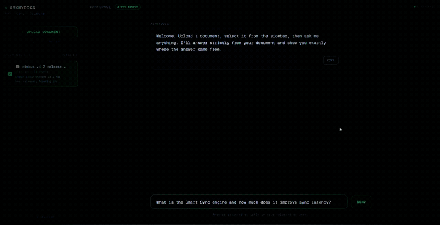

# AskMyDocs — AI Document Q&A Tool

<p align="center">
  <a href="https://intellect-docs-ai.vercel.app"></a>
  
  <a href="https://github.com/ayush-s-tomar/intellect-docs-ai/actions/workflows/ci.yml"></a>
  
</p>

<p align="center">
  
  
  
  
  
  
  
  
</p>

<p align="center">
  Upload any document and ask questions about it in plain English.<br/>
  Every answer is grounded strictly in your document and cited down to the exact chunk — no hallucinations, full transparency.
</p>

<p align="center">
  <a href="https://intellect-docs-ai.vercel.app"><b>🔗 Live Demo</b></a> ·
  <a href="#how-it-works">How it works</a> ·
  <a href="#rag-quality-evaluation">Eval results</a> ·
  <a href="#how-to-run-locally">Run locally</a>
</p>

<p align="center">
  
</p>

<details>
<summary><b>🎥 Full video walkthrough</b></summary>
<br/>

https://github.com/user-attachments/assets/ae12af1b-3d89-4094-8c55-4f79a30ad8d7

</details>

---

## Why this exists

Most "chat with your PDF" demos either hallucinate past the source document or hide *why* an answer was given. AskMyDocs was built to fix both: every answer is generated **strictly** from retrieved chunks, every chunk is shown with its similarity score, and a built-in eval harness scores retrieval + answer quality against a fixed benchmark — so retrieval or prompt changes can be regression-tested instead of eyeballed, the same discipline production RAG systems use before shipping.

## What it does

- Upload any `.txt` or `.pdf` document and select it from the sidebar
- Ask any question about it in natural language
- Get an answer generated strictly from your document, rendered with full markdown (bold, lists, headings, code blocks)
- See exactly which chunks the answer came from, with similarity match scores
- Run built-in evals to automatically grade retrieval and answer quality
- Anonymous, session-scoped multi-user support — no signup required
- Rate-limited API with automated uptime keepalive
- Real-time streaming responses via Groq

---

## Tech Stack

| Layer | Tech |
|---|---|
| Frontend | Next.js 15, TypeScript, Tailwind CSS |
| AI / LLM | Groq API (OpenAI GPT-OSS 20B) |
| Embeddings | Cohere embed-english-light-v3.0 (384-dim), asymmetric query/document encoding |
| Database | Supabase (PostgreSQL + pgvector) |
| Retrieval | Hybrid search — pgvector cosine similarity + Postgres full-text search, fused via Reciprocal Rank Fusion (RRF) |
| Rate Limiting | Upstash Redis |
| Deployment | Vercel |

<details>
<summary><b>Architecture diagram</b></summary>

```
Upload                          Query
  │                                │
  ▼                                ▼
chunker.ts              useSessionId.ts (anon session)
(sentence-aware,                  │
 800-char chunks,                 ▼
 150-char overlap,          embedQuery() — Cohere
 word-boundary safe)      (search_query input_type)
  │                                │
  ▼                                ▼
embedText() — Cohere      hybrid_search_chunks() RPC
(search_document          (pgvector cosine + full-text
 input_type, batched)      search, fused via RRF,
  │                         session + doc scoped)
  ▼                                │
Supabase: documents +              ▼
chunks (+ embedding_v2)    top-5 matching chunks
                                    │
                                    ▼
                            Groq (openai/gpt-oss-20b)
                            streams answer from context
                                    │
                                    ▼
                            UI: answer + source chunks
                            shown with match %
```

</details>

---

## How it works

1. User uploads a document
2. `chunker.ts` splits it into sentence-aware chunks (~800 characters, 150-character overlap), with a guard so any single oversized sentence still gets hard-split rather than truncated, and overlap slicing snaps to word boundaries so chunks never open mid-word
3. Each chunk is embedded via Cohere with `input_type: search_document` and stored in Supabase alongside its 384-dimension vector
4. When a question is asked, the question itself is embedded with `input_type: search_query` — Cohere's model is asymmetric, so queries and documents are deliberately encoded differently to maximize match quality — and matched against stored chunks using the `hybrid_search_chunks` Postgres RPC, which fuses pgvector cosine similarity with full-text search (`websearch_to_tsquery`) via Reciprocal Rank Fusion, scoped to the caller's session and selected document
5. The top 5 matching chunks are sent to Groq as context
6. Groq streams back an answer based strictly on those chunks
7. The UI renders the answer as formatted markdown, plus the source chunks it came from, with a similarity match percentage for each

---

## RAG Quality Evaluation

AskMyDocs ships with a built-in evaluation harness (`/api/eval`, dashboard at `/eval`) that automatically tests retrieval and answer quality against a fixed question set — an actual quality gate for the RAG pipeline, not just a demo.

<details>
<summary><b>How the eval pipeline scores each answer</b></summary>

For each test question:

1. Embeds the question with `embedQuery` and retrieves the top 5 matching chunks via the same `hybrid_search_chunks` RPC used in production
2. Generates an answer from those chunks using Groq (`openai/gpt-oss-20b`)
3. **LLM-as-judge scoring** — a second Groq call grades the answer 0–10 on relevance, factual accuracy against the *same full retrieved context* the answer model saw, and clarity, returning a structured score and a one-line justification
4. **Keyword validation** — checks the answer for expected keywords as a deterministic check alongside the LLM score
5. Aggregates results into a summary: average score, pass/fail count (pass = score ≥ 6), pass rate, average chunks retrieved, and a letter grade (A–D)

Test questions live in `src/lib/evalQuestions.ts`. One question (a multi-turn follow-up that depends on conversation history) is intentionally excluded from the automated loop via an `automated: false` flag, since a stateless one-shot eval harness can't answer it — it's kept as a manual test case for the chat UI instead.

</details>

**Live benchmark numbers are on the [`/eval` dashboard](https://intellect-docs-ai.vercel.app/eval)** rather than pasted here as a static figure — a hardcoded score would go stale the moment retrieval or prompting changes, and an eval system you can't trust to stay current isn't much of a quality gate.

---

## Reliability & Production-Readiness

- **Rate limiting** — Upstash Redis sliding-window limits protect the API on a free-tier deployment: 30 chat requests/minute and 20 uploads/hour per IP, tracked separately with analytics enabled.
- **Health check + uptime automation** — `/api/health` pings Supabase and is hit on a schedule, keeping the free-tier Supabase project from auto-pausing due to inactivity.
- **Separated Supabase clients** — a public client (anon key, respects Row Level Security) and an admin client (service role key, server-only) are exported separately, so a service-role secret can never accidentally ship to the browser bundle.
- **Continuous Integration** — every push runs an automated GitHub Actions workflow that lints, type-checks, and builds the project, catching errors before they reach production.
- **Handled a live upstream breaking change** — when Groq deprecated `llama-3.1-8b-instant` in June 2026, the chat and eval pipelines were migrated to `openai/gpt-oss-20b` with no downtime, and request validation was hardened (Zod schema now coerces numeric document IDs defensively at the API boundary rather than rejecting them).

---

## Session & Multi-User Isolation

AskMyDocs supports multiple concurrent users without requiring login:

- On first visit, `useSessionId.ts` generates a `crypto.randomUUID()` and persists it in `localStorage`, giving each browser a stable, anonymous identity.
- Every upload, fetch, and delete request is scoped server-side by `session_id` — `/api/documents` and `hybrid_search_chunks` only ever return or modify data matching the caller's session, so users never see or delete each other's documents on a shared deployment.
- This is a deliberate lightweight-auth tradeoff: zero signup friction for a demo/portfolio tool, while still enforcing real data isolation.

---

## Database Schema

The full schema (pgvector extension, session-scoped columns, full-text search index, indexes, and the `hybrid_search_chunks` / legacy `match_chunks` functions) lives in `supabase/schema.sql` — a single source of truth instead of scattered migration history in the Supabase dashboard.

---

<details>
<summary><b>Project Structure</b></summary>

```
src/
├── app/
│   ├── api/
│   │   ├── chat/        # Streaming AI responses via Groq
│   │   ├── documents/   # Fetch and delete documents (session-scoped)
│   │   ├── eval/        # Automated RAG quality evaluation
│   │   ├── health/      # Uptime keepalive ping
│   │   └── upload/      # File upload, chunking, storage
│   ├── eval/
│   │   └── page.tsx     # Eval results dashboard
│   ├── icon.png         # App icon / favicon
│   └── page.tsx         # Main UI (markdown-rendered chat)
├── hooks/
│   └── useSessionId.ts  # Anonymous session identity
└── lib/
    ├── supabase.ts          # Public + admin Supabase clients
    ├── embeddings.ts        # Cohere embedding calls — embedText (documents) + embedQuery (search)
    ├── chunker.ts            # Sentence-aware, word-boundary-safe document chunking
    ├── chunks-repository.ts  # Hybrid search + fallback retrieval logic
    ├── evalQuestions.ts      # Eval test question set
    ├── validation.ts         # Zod request schemas
    └── ratelimit.ts          # Upstash rate limiters
supabase/
└── schema.sql           # Full database schema
assets/
└── askmydocs-demo.gif   # README demo GIF
```

</details>

<details>
<summary><b>How to run locally</b></summary>

**1. Clone the repo**
```bash
git clone https://github.com/ayush-s-tomar/intellect-docs-ai.git
cd intellect-docs-ai
```

**2. Install dependencies**
```bash
npm install
```

**3. Set up environment variables**

Create a `.env.local` file in the root folder:
```
GROQ_API_KEY=your_groq_api_key
COHERE_API_KEY=your_cohere_api_key
NEXT_PUBLIC_SUPABASE_URL=your_supabase_project_url
NEXT_PUBLIC_SUPABASE_ANON_KEY=your_supabase_anon_key
SUPABASE_SERVICE_ROLE_KEY=your_supabase_service_role_key
UPSTASH_REDIS_REST_URL=your_upstash_redis_url
UPSTASH_REDIS_REST_TOKEN=your_upstash_redis_token
```

Get your keys from:
- Groq API key → [console.groq.com](https://console.groq.com)
- Cohere API key → [dashboard.cohere.com](https://dashboard.cohere.com)
- Supabase keys → [supabase.com](https://supabase.com) → your project → Settings → API
- Upstash keys → [console.upstash.com](https://console.upstash.com) → your Redis database → REST API

**4. Set up the database**

Run `supabase/schema.sql` in your Supabase SQL Editor.

**5. Run the development server**
```bash
npm run dev
```

**6. Open in browser**

[http://localhost:3000](http://localhost:3000)

</details>

<details>
<summary><b>Deployment</b></summary>
<br/>

This project is deployed on [Vercel](https://vercel.com) — the official platform for Next.js apps.

To deploy your own:
1. Push the repo to GitHub
2. Go to vercel.com → New Project → Import repo
3. Add all environment variables in the Vercel dashboard
4. Deploy — done in under 2 minutes

</details>

---

## Engineering Decisions & Key Challenges

- **Diagnosed a query/document embedding asymmetry bug** — questions were being embedded with Cohere's `search_document` input type instead of `search_query`, silently degrading retrieval relevance across the entire pipeline despite chunk embeddings themselves being correct.
- **Found and fixed a chunk-truncation mismatch** — chunks were stored at ~800 characters but only the first 512 were ever embedded, meaning the embedding didn't represent the back half of many chunks.
- **Fixed a mid-word chunk-boundary bug** — the overlap buffer used a raw character-count slice with no word-boundary awareness, occasionally splitting a chunk open mid-word; fixed by snapping the slice forward to the next word boundary, with a regression test added to catch it if it recurs.
- **Built an LLM-as-judge evaluation harness, then found a scoring bug in the judge itself** — the judge was scoring answers against a context slice far shorter than what the answer model actually saw, causing it to falsely penalize correct answers as "not supported by context."
- **Diagnosed silent reasoning-model token exhaustion** — `openai/gpt-oss-20b` spends part of its token budget on internal reasoning before writing output; under-provisioned `max_tokens` caused it to silently return empty answers on harder questions with no error, only visible via structured logging of `finish_reason`.
- **Migrated to hybrid search** — combined pgvector cosine similarity with Postgres full-text search via Reciprocal Rank Fusion (RRF), so exact terms, proper nouns, and numeric values that embed poorly semantically are still reliably retrieved.
- Separated public and admin Supabase clients so a service-role secret can never leak into the browser bundle.
- Implemented session-scoped multi-user isolation without requiring authentication — zero signup friction while still enforcing real per-user data boundaries.
- Added rate limiting (Upstash Redis) and an automated uptime keepalive to keep a free-tier deployment stable under real traffic.
- Set up CI (lint, type-check, build) on every push so regressions are caught before they reach production.
- Handled Groq's deprecation of `llama-3.1-8b-instant` by migrating the chat and eval pipelines to `openai/gpt-oss-20b` with no downtime, and hardened request validation (Zod) to coerce numeric document IDs defensively at the API boundary.

---

## License

MIT License — see [`LICENSE`](LICENSE) for details.

## Author

**Ayush Singh Tomar** — [GitHub](https://github.com/ayush-s-tomar)

*Part of my AI developer portfolio — agents and models that do real, measurable work. See also: [SalesAgent](https://github.com/ayush-s-tomar/salesagent), an autonomous B2B lead-research and outreach agent, and [resume-screener-lora](https://github.com/ayush-s-tomar/resume-screener-lora), a LoRA fine-tuned resume screening model.*
