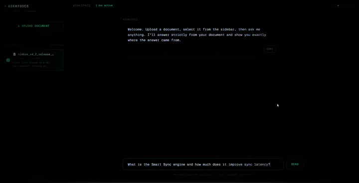
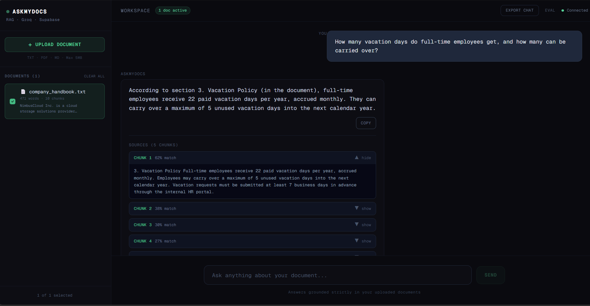

# AskMyDocs: AI Document Q&A with Cited Answers

<p align="center">
  <a href="https://intellect-docs-ai.vercel.app"></a>
  
  <a href="https://github.com/ayush-s-tomar/intellect-docs-ai/actions/workflows/ci.yml"></a>
  
</p>

<p align="center">
  
  
  
  
  
  
  
</p>

<p align="center">
  Upload a document and ask questions about it in plain English.<br/>
  Every answer is generated strictly from your document and shown next to the exact chunks it came from, with similarity scores.
</p>

<p align="center">
  <a href="https://intellect-docs-ai.vercel.app"><b>🔗 Live Demo</b></a> ·
  <a href="#how-it-works">How it works</a> ·
  <a href="#engineering-decisions--key-challenges">Engineering decisions</a> ·
  <a href="#rag-quality-evaluation">Eval</a> ·
  <a href="#how-to-run-locally">Run locally</a>
</p>

<p align="center">
  
</p>

<details>
<summary><b>📷 Screenshot + 🎥 full video walkthrough</b></summary>
<br/>



<br/><br/>

https://github.com/user-attachments/assets/ae12af1b-3d89-4094-8c55-4f79a30ad8d7

</details>

---

## Highlights

* **Grounded, cited answers.** Each answer is generated only from retrieved chunks and displayed with those chunks and their match scores, so you can see why the model said what it said.
* **Hybrid retrieval.** pgvector cosine similarity and Postgres full-text search are fused with Reciprocal Rank Fusion, so both semantic matches and exact terms, names and numbers are found.
* **Built-in eval harness.** An LLM-as-judge pipeline (`/eval`) plus a deterministic keyword check scores retrieval and answer quality, backed by a Vitest suite for the chunker and request validation.
* **Production hygiene.** CI on every push, Redis-backed rate limiting that fails open, scheduled keep-alive jobs, and a zero-downtime migration off a deprecated model.

## Why this exists

Most "chat with your PDF" demos either hallucinate past the source or hide why an answer was given. AskMyDocs shows its work: every chunk is visible with its similarity score, and a built-in eval harness lets retrieval and prompt changes be regression-tested instead of eyeballed.

## Features

* Upload `.txt` or `.pdf` files and pick a document from the sidebar
* Ask questions in natural language and get streaming answers rendered as markdown
* Inspect the source chunks behind every answer, with similarity percentages
* Run the built-in eval from the `/eval` dashboard
* Anonymous, session-scoped multi-user isolation with no signup
* Rate-limited API with automated uptime keep-alives

---

## Tech Stack

| Layer | Tech |
|---|---|
| Frontend | Next.js 15, TypeScript, Tailwind CSS |
| LLM | Groq API (`openai/gpt-oss-20b`) |
| Embeddings | Cohere `embed-english-light-v3.0` (384-dim), asymmetric query/document encoding |
| Database | Supabase (PostgreSQL + pgvector) |
| Retrieval | Hybrid search: pgvector cosine similarity + Postgres full-text search, fused via RRF |
| Rate limiting | Upstash Redis |
| CI / Deployment | GitHub Actions, Vercel |

<details>
<summary><b>Architecture diagram</b></summary>

```
Upload                          Query
  │                                │
  ▼                                ▼
chunker.ts              useSessionId.ts (anon session)
(sentence-aware,                  │
 800-char chunks,                 ▼
 150-char overlap,          embedQuery() (Cohere)
 word-boundary safe)      (search_query input_type)
  │                                │
  ▼                                ▼
embedText() (Cohere)      hybrid_search_chunks() RPC
(search_document          (pgvector cosine + full-text
 input_type, batched)      search, fused via RRF,
  │                         session + doc scoped)
  ▼                                │
Supabase: documents +              ▼
chunks                     top-5 matching chunks
                                    │
                                    ▼
                            Groq (openai/gpt-oss-20b)
                            streams answer from context
                                    │
                                    ▼
                            UI: answer + source chunks
                            shown with match %
```

</details>

---

## How it works

1. **Upload.** `chunker.ts` splits the document into sentence-aware chunks (~800 characters, 150-character overlap). Oversized sentences are hard-split rather than truncated, and overlap snaps to word boundaries so chunks never open mid-word.
2. **Embed and store.** Each chunk is embedded with Cohere (`input_type: search_document`) and stored in Supabase with its 384-dimension vector.
3. **Retrieve.** The question is embedded with `input_type: search_query`, because Cohere's model is asymmetric. The `hybrid_search_chunks` RPC fuses vector similarity with full-text search (`websearch_to_tsquery`) via RRF, scoped to the caller's session and selected document.
4. **Answer.** The top 5 chunks go to Groq as context, and the answer streams back based strictly on them.
5. **Show the work.** The UI renders the markdown answer and the source chunks with a similarity percentage for each.

---

## Engineering Decisions & Key Challenges

**Retrieval quality**
* **Query/document embedding asymmetry.** Questions were being embedded with Cohere's `search_document` input type instead of `search_query`, which quietly degraded retrieval across the whole pipeline.
* **Chunk truncation mismatch.** Chunks were stored at ~800 characters but only the first 512 were embedded, so many embeddings ignored the back half of their chunk.
* **Mid-word chunk boundaries.** The overlap buffer sliced by raw character count; it now snaps to the next word boundary, with a regression test.
* **Hybrid search.** Added full-text search fused with vector search via RRF, so proper nouns and numbers that embed poorly are still retrieved.

**Eval and LLM behavior**
* **Judge bug.** The LLM judge scored answers against a much shorter context slice than the answer model saw, so it falsely penalized correct answers. It now sees the same context.
* **Reasoning-model token exhaustion.** `gpt-oss-20b` spends part of `max_tokens` on hidden reasoning, so small budgets returned empty answers with no error. This was only visible by logging `finish_reason`; calls now retry once with a larger budget.
* **Free-tier rate limits.** The eval's back-to-back calls hit Groq's tokens-per-minute cap, and failed judge calls were scored 0. The harness now retries on 429s, waits for the "try again in Ns" hint Groq returns, and requests smaller token budgets.

**Reliability and security**
* **Zero-downtime model migration.** When Groq deprecated `llama-3.1-8b-instant`, chat and eval were moved to `openai/gpt-oss-20b`, and Zod validation now coerces numeric document IDs at the API boundary.
* **Fail-open rate limiter.** A Redis outage (an expired free-tier database) used to break uploads and chat. The limiter now fails open, and uploads roll back cleanly on failure.
* **Separated Supabase clients.** The service-role key lives only in a server-side admin client and can never reach the browser bundle.
* **Session isolation without auth.** Every read and write is scoped by an anonymous `session_id`, giving real per-user data boundaries with no signup.

---

## RAG Quality Evaluation

AskMyDocs ships with a built-in evaluation harness (`/api/eval`, dashboard at [`/eval`](https://intellect-docs-ai.vercel.app/eval)) that tests retrieval and answer quality against a fixed question set.

**Latest recorded run (Oct 2026):** Grade **B**, **6.7/10** average, **86%** pass rate (6 of 7 questions scoring 6/10 or higher), on one real job-description document.

**How to read that number.** It is a self-assessed signal: the same Groq model family answers and judges. It comes from one document and seven questions, so treat it as an internal regression check ("did this change make things worse?"), not an independent benchmark. It is paired with a deterministic keyword check and a Vitest suite that don't depend on LLM judgment. The live dashboard is always the current source of truth.

<details>
<summary><b>How the eval pipeline scores each answer</b></summary>

For each test question:

1. Embeds the question with `embedQuery` and retrieves the top 5 chunks through the same `hybrid_search_chunks` RPC used in production
2. Generates an answer from those chunks with Groq (`openai/gpt-oss-20b`)
3. **LLM-as-judge.** A second Groq call scores the answer 0 to 10 on relevance, accuracy against the same retrieved context the answer model saw, and clarity, returning a score and a one-line reason
4. **Keyword check.** Verifies expected keywords appear in the answer, as a deterministic signal beside the LLM score
5. Aggregates average score, pass/fail count, pass rate, average chunks retrieved, and a letter grade (A to D)

Rate-limited calls are retried automatically. Test questions live in `src/lib/evalQuestions.ts`. One multi-turn follow-up question is excluded from the automated loop (`automated: false`) because a stateless harness can't answer it; it stays as a manual chat test.

</details>

---

## Reliability & Production-Readiness

* **Rate limiting.** Upstash Redis sliding-window limits: 30 chat requests/minute and 20 uploads/hour per IP, tracked separately. If Redis is unreachable, the limiter fails open instead of taking the app down.
* **Keep-alives.** `/api/health` pings Supabase on a schedule, and a twice-weekly GitHub Actions job pings Upstash Redis, so both free-tier databases stay below their inactivity-pause thresholds.
* **Continuous integration.** Every push runs lint, type-check and build in GitHub Actions.
* **Structured logging.** API routes log structured JSON (including model `finish_reason`), which is how the silent empty-answer bug was found.

---

## Session & Multi-User Isolation

* On first visit, `useSessionId.ts` generates a `crypto.randomUUID()` and persists it in `localStorage`, giving each browser a stable anonymous identity.
* Every upload, fetch and delete is scoped server-side by `session_id`. `/api/documents` and `hybrid_search_chunks` only return or modify data for the caller's session.
* This is a deliberate lightweight-auth tradeoff: no signup friction, with real data isolation.

---

## Database Schema

The full schema (pgvector extension, session-scoped columns, full-text index, and the `hybrid_search_chunks` and legacy `match_chunks` functions) lives in `supabase/schema.sql`.

---

<details>
<summary><b>Project Structure</b></summary>

```
.github/workflows/
├── ci.yml               # Lint, type-check, build on every push
└── keepalive.yml        # Twice-weekly Upstash Redis ping
src/
├── app/
│   ├── api/
│   │   ├── chat/        # Streaming AI responses via Groq
│   │   ├── documents/   # Fetch and delete documents (session-scoped)
│   │   ├── eval/        # Automated RAG quality evaluation
│   │   ├── health/      # Uptime keep-alive ping
│   │   └── upload/      # File upload, chunking, storage
│   ├── eval/
│   │   └── page.tsx     # Eval results dashboard
│   ├── icon.png         # App icon / favicon
│   └── page.tsx         # Main UI (markdown-rendered chat)
├── hooks/
│   └── useSessionId.ts  # Anonymous session identity
└── lib/
    ├── supabase.ts          # Public + admin Supabase clients
    ├── embeddings.ts        # Cohere embeddings: embedText (documents) + embedQuery (search)
    ├── chunker.ts           # Sentence-aware, word-boundary-safe chunking
    ├── chunks-repository.ts # Hybrid search + fallback retrieval
    ├── evalQuestions.ts     # Eval test question set
    ├── validation.ts        # Zod request schemas
    └── ratelimit.ts         # Upstash rate limiters (fail-open)
supabase/
└── schema.sql           # Full database schema
assets/
└── askmydocs-demo.gif   # README demo GIF
```

</details>

<details>
<summary><b>How to run locally</b></summary>

**1. Clone the repo**
```bash
git clone https://github.com/ayush-s-tomar/intellect-docs-ai.git
cd intellect-docs-ai
```

**2. Install dependencies**
```bash
npm install
```

**3. Set up environment variables**

Create a `.env.local` file in the root folder:
```
GROQ_API_KEY=your_groq_api_key
COHERE_API_KEY=your_cohere_api_key
NEXT_PUBLIC_SUPABASE_URL=your_supabase_project_url
NEXT_PUBLIC_SUPABASE_ANON_KEY=your_supabase_anon_key
SUPABASE_SERVICE_ROLE_KEY=your_supabase_service_role_key
UPSTASH_REDIS_REST_URL=your_upstash_redis_url
UPSTASH_REDIS_REST_TOKEN=your_upstash_redis_token
```

Get your keys from:
* Groq → [console.groq.com](https://console.groq.com)
* Cohere → [dashboard.cohere.com](https://dashboard.cohere.com)
* Supabase → [supabase.com](https://supabase.com) → your project → Settings → API
* Upstash → [console.upstash.com](https://console.upstash.com) → your Redis database → REST API

**4. Set up the database**

Run `supabase/schema.sql` in your Supabase SQL Editor.

**5. Start the dev server**
```bash
npm run dev
```

**6. Open** [http://localhost:3000](http://localhost:3000)

**Optional: keep-alive.** To use the Redis keep-alive workflow on your own fork, add `UPSTASH_REDIS_REST_URL` and `UPSTASH_REDIS_REST_TOKEN` as repository secrets.

</details>

<details>
<summary><b>Deployment</b></summary>
<br/>

Deployed on [Vercel](https://vercel.com). To deploy your own:
1. Push the repo to GitHub
2. Vercel → New Project → import the repo
3. Add all environment variables in the Vercel dashboard
4. Deploy

The eval route sets `maxDuration = 300` because it waits out Groq rate limits; make sure your Vercel plan or Fluid Compute setting allows it.

</details>

---

## Roadmap

* [ ] Multi-turn conversation memory in the automated eval loop
* [ ] An independent, non-self-graded quality check (a different model family as judge)
* [ ] Multi-document Q&A across several uploads at once
* [ ] Optional persistent accounts so documents survive across devices

---

## License

MIT. See [`LICENSE`](LICENSE).

## Author

**Ayush Singh Tomar**: [GitHub](https://github.com/ayush-s-tomar) · [LinkedIn](https://www.linkedin.com/in/ayushsinghtomar) · [Portfolio](https://ayush-s-tomar.vercel.app)

*See also: [SalesAgent](https://github.com/ayush-s-tomar/salesagent), an autonomous B2B lead-research and outreach agent, and [resume-screener-lora](https://github.com/ayush-s-tomar/resume-screener-lora), a LoRA fine-tuned resume screening model.*
